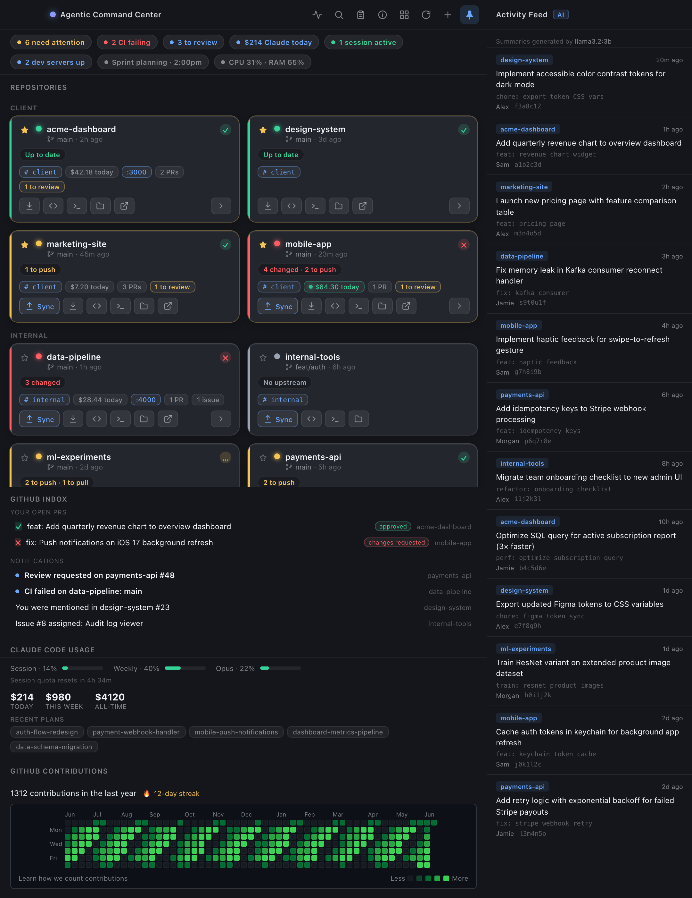

# Agentic Command Center

Hi folks! I'm publishing a useful little tool I've built for managing multiple AI-enabled projects in parallel. This dashboard is something that's intended to stay up on your screen during development so you can stay organized and focus on what's most important.

The tool is designed as a macOS desktop app (Electron + React + TypeScript) that is a single, always-on-top **command
center** for every project you work on. Instead of juggling terminals, GitHub tabs, and Claude
Code, it pulls all of it into one window: each repo's git status, CI result, open pull requests,
Claude Code cost and sessions, running dev servers, your GitHub inbox, and your contribution graph.
A pull-out **activity feed** adds a live, cross-repo stream of your latest commits — each summarized
by a **local LLM** — so you can see what your agents have shipped at a glance.

Everything is **read-only and local-first** — the app shells out to tools you already have (`git`,
the [GitHub CLI](https://cli.github.com), Claude Code) and **never stores a single credential of its
own**. If a tool isn't installed or signed in, that one panel simply shows as unavailable and the
rest keeps working.

<p align="center">
  
</p>

<p align="center"><sub>Repository names and figures above are illustrative sample data.</sub></p>

---

## Table of contents

- [Features at a glance](#features-at-a-glance)
- [Requirements](#requirements)
- [Install](#install)
- [The interface, explained](#the-interface-explained)
  - [Toolbar](#toolbar)
  - [Health bar](#health-bar)
  - [Repository cards (dashboard view)](#repository-cards-dashboard-view)
  - [Compact view](#compact-view)
  - [Command palette (⌘K)](#command-palette-k)
  - [Standup digest](#standup-digest)
  - [Activity feed](#activity-feed)
  - [GitHub inbox](#github-inbox)
  - [Claude Code Usage & cost](#claude-code-usage--cost)
  - [GitHub Contributions](#github-contributions)
  - [Info card](#info-card)
- [Where your data comes from (and privacy)](#where-your-data-comes-from-and-privacy)
- [Refresh cadence](#refresh-cadence)
- [Configuration & persisted state](#configuration--persisted-state)
- [How it works (architecture)](#how-it-works-architecture)
- [Security model](#security-model)
- [Project layout](#project-layout)
- [Development](#development)
- [Building & releasing](#building--releasing)
- [FAQ](#faq)
- [Troubleshooting](#troubleshooting)
- [License](#license)

---

## Features at a glance

**Repositories**
- Import any number of local git repos; see commit/push/pull state at a glance.
- One-click **sync** (stage → commit → push) and **fetch** per repo.
- Per-repo **CI status**, **open-PR / needs-review / assigned-issue** counts (via `gh`).
- Last-commit age, expandable **changed-file list**, and **npm script runner** (dev/build/test/…).
- Quick actions: open in **editor / Terminal / Finder / GitHub**.
- **Favorite** (★) and **group** repos; the dashboard organizes into labeled sections.
- **Compact view** — the classic colored-tile grid — toggleable from the toolbar.
- **Activity feed** (pull-out) — a live, RSS-/social-style stream of recent commits across **every**
  repo, each summarized by a **local LLM** ([ollama](https://ollama.com)); falls back to raw commit
  messages when ollama isn't running.

**Agentic / Claude Code**
- Per-project **estimated cost** (today / this week / all-time) computed from local transcripts.
- **Active session** detection ("working now"), session counts, and your **recent plan files**.
- **Quota bars** (5-hour, weekly, weekly-Opus) with a reset countdown.

**GitHub**
- **Contribution graph** (incl. private contributions) with a current-streak readout.
- **Inbox**: notifications + your open PRs with checks and review state.

**Local environment & productivity**
- Running **dev servers** detected and mapped to the owning repo (click the port to open it).
- **Aggregate health bar** summarizing everything in one line, plus CPU/RAM and next calendar event.
- **⌘K command palette**, cross-repo **standup digest**, **folder scanning** to bulk-import repos.
- **Native notifications** on CI failures, new review requests, and high Claude usage.
- **Settings export/import** to move your setup between machines.

---

## Requirements

| To use… | You need… |
|---|---|
| **The app at all** | macOS (Apple Silicon for the prebuilt `.dmg`; build from source for Intel). |
| **Repo status / commit / push / fetch** | `git` on your `PATH`, plus your usual push auth (HTTPS credential helper or SSH key). |
| **CI, PRs, issues, inbox, contribution graph** | [`gh`](https://cli.github.com) installed and signed in (`brew install gh && gh auth login`). |
| **Claude usage bars + cost panel** | [Claude Code](https://claude.com/claude-code) installed and signed in on this machine. |
| **Activity-feed AI summaries** | [ollama](https://ollama.com) running locally with any model pulled — *optional*; without it the feed shows raw commit messages. |
| **Today's calendar event** | macOS Calendar with at least one account (grants an Automation prompt once). |
| **Building from source** | Node.js ≥ 18 with npm. |

Everything is **optional and independent** — missing `gh`, Claude Code, or Calendar only disables
that specific panel, and without **ollama** the activity feed simply shows raw commit messages
instead of AI summaries.

---

## Install

### Option A — Prebuilt app (`.dmg`)

1. Download the latest **`.dmg`** (Apple Silicon / arm64 — e.g.
   `Agentic.Command.Center-<version>-arm64.dmg`) from the
   [**Releases**](https://github.com/jashankish/agentic-command-center/releases) page.
2. Open the `.dmg` and drag **Agentic Command Center** into **Applications**.
3. **First launch (unsigned app).** It isn't notarized with an Apple Developer certificate, so
   Gatekeeper warns once. Either **right-click → Open → Open**, or clear the quarantine flag:
   ```bash
   xattr -dr com.apple.quarantine "/Applications/Agentic Command Center.app"
   ```
4. Launch it, click **+** to import repos, and (optionally) run `gh auth login` for the GitHub
   panels and install [ollama](https://ollama.com) for AI-summarized activity-feed entries.

### Option B — Build it yourself

```bash
git clone https://github.com/jashankish/agentic-command-center.git
cd agentic-command-center
npm install

npm run dev        # run from source with hot reload
# — or —
npm run dist       # package a .dmg for your Mac's architecture → dist/
open dist/
```

A self-built `.dmg` is also unsigned, so the same first-launch step applies. The
[`build.sh`](#building--releasing) helper wraps `npm run dist` and can commit/push/release in one
command.

---

## The interface, explained

The window stacks, top to bottom: **toolbar → health bar → repositories → GitHub inbox → Claude
Code usage → GitHub contributions**. Hover almost anything for a tooltip, and click the **ℹ️**
toolbar button anytime for an in-app legend of every icon plus the cost math.

### Toolbar

| Button | Does |
|---|---|
| 〰️ **Activity** | Slide out the [activity feed](#activity-feed) — recent commits across every repo (highlighted while open). |
| 🔍 **Search** | Open the [command palette](#command-palette-k) (also **⌘K**). |
| 📋 **Standup** | Open the [standup digest](#standup-digest). |
| ℹ️ **Info** | Open the [info card](#info-card) — a legend for every symbol and the cost logic. |
| ▦ / ▤ **Layout** | Toggle **dashboard** (cards) ↔ **compact** (tiles). |
| ↻ **Refresh** | Re-fetch every panel now. |
| **+** **Import** | Add local git repos via a folder picker. |
| 📌 **Pin** | Keep the window floating above other apps (on by default; highlighted when active). |

### Health bar

A live, one-line summary directly under the toolbar. Each chip only appears when relevant:

- **N need attention** — repos that are uncommitted, unpushed, unpulled, or have no upstream.
- **N CI failing** — repos whose latest GitHub Actions run failed.
- **N to review** — open PRs across your repos that request *your* review.
- **$X Claude today** — estimated Claude Code spend today (see [cost](#claude-code-usage--cost)).
- **N sessions active** — Claude Code sessions touched in the last few minutes.
- **N dev servers up** — running local servers mapped to an imported repo.
- **&lt;event&gt; · time** — your next calendar event today.
- **CPU x% · RAM y%** — system load (1-minute average) and memory use.

### Repository cards (dashboard view)

Each imported repo is a card. The **left accent stripe** and **status dot** encode git state:

| Color | Meaning | Example badge |
|---|---|---|
| 🟢 Green | Clean and pushed | `Up to date` |
| 🟡 Amber | Ahead and/or behind the remote | `2 to push`, `1 to pull`, `2 to push · 1 to pull` |
| 🔴 Red | Uncommitted changes in the working tree | `4 changed`, `4 changed · 2 to push` |
| ⚪ Gray | No upstream branch, or not a git repo / error | `No upstream`, `Missing Repo` |

Other elements on a card:

- **Branch · age** — current branch and time since the last commit (e.g. `main · 4h ago`).
- **CI badge** (✓ / ✕ / …) — pass / fail / running for the latest Actions run (needs `gh`).
- **Chips** — `$ today` (green pulse = a session is active right now), a clickable **`:port`** for a
  running dev server, **`N PRs`**, **`N to review`**, **`N issues`**, and a **`# group`** chip.
- **Actions row**:
  - **Sync** — stage all → commit (you'll be prompted for a message) → push the current branch
    (sets upstream with `-u origin <branch>` on first push). Only shown when there's something to do.
  - **Fetch** (⬇) — `git fetch origin` so ahead/behind counts stay accurate.
  - **Editor / Terminal / Finder / GitHub** — open the repo in your editor (Cursor, VS Code, Zed, or
    Sublime — whichever is installed), a Terminal, Finder, or its GitHub page.
  - **Expand** (chevron) — reveals the **changed-file list** and **npm script buttons**
    (`dev`/`build`/`test`/`lint`); clicking a script runs `npm run <name>` in a new Terminal window.
- **★ Favorite** — pins the repo to the top of its group.
- **`# group`** — click to assign a label; the dashboard then renders cards in **grouped sections**
  (favorites first within each group).
- **×** — removes the repo from the app's list. *This only forgets it — it never touches your files.*

### Compact view

The toolbar layout toggle switches to the original **GitHub-Desktop-style grid** of square colored
tiles (same status colors as above). Click any non-green tile to open the commit dialog and
sync. Useful when you want a denser overview.

### Command palette (⌘K)

Press **⌘K** (or the 🔍 button) for a fuzzy-searchable list. It includes **every action** — Import,
Scan folder, Standup, Refresh, toggle view, Export/Import settings — plus a per-repo **Open in
editor / Reveal in Finder / Open on GitHub** entry, so you can drive the whole app from the keyboard.

### Standup digest

The 📋 button opens a digest of **your own commits across all repos** over **Today / 24h / 7 days**
(filtered by your `git config user.email`). Click **Copy** to put a plain-text summary on your
clipboard — handy for standups or work logs. It also shows your estimated Claude spend over the same
window.

### Activity feed

The 〰️ button (first in the toolbar's action row) slides out a **live activity feed** — a real-time,
RSS-/social-style stream of the **most recent commits across every imported repo**, newest first, so
you can see what your agents have been building at a glance.

- **Each entry** shows the **repo**, a **relative timestamp**, the commit **summary**, the **author**,
  and a short **hash** that links straight to the commit on GitHub. When a summary differs from the
  raw commit subject, the original is shown underneath in monospace.
- **Local-LLM summaries.** When [ollama](https://ollama.com) is running, each commit message is
  rewritten into one clear, specific sentence — ideal when agent-authored commits are terse or
  auto-generated. The header shows an **AI** badge with the model name; with no ollama it shows a
  **raw** badge and the original subjects. The app prefers a small, fast local model (e.g.
  `llama3.2:3b`, `qwen2.5:3b`, `phi3:mini`). Summaries are generated **in the background** (commits
  appear instantly, then upgrade as the model finishes), **cached per commit hash** so the model is
  never asked twice, and **never leave your machine**.
- **Its own window.** The feed renders in a separate, frameless window docked just off the main
  window's edge — it **extends beyond** the app without resizing it or covering any content, carries
  the same native rounded corners, **follows** the window as you move or resize it, and **floats with
  it** when pinned. Click the 〰️ button again to slide it away.
- **Live.** While open it refreshes **every 20 seconds** (and immediately whenever re-shown), so new
  commits and freshly-finished summaries stream in on their own.

It reads the 5 most-recent non-merge commits per repo (across all branches), merges them, and shows
the latest 40 entries.

### GitHub inbox

Appears below the repositories when `gh` is signed in and you have items:

- **Your open PRs** across all repos, each with a checks badge (✓/✕/…) and review state
  (approved / changes requested / review required) — click to open on GitHub.
- **Notifications** (mentions, review requests, CI activity, assignments) with unread dots.

### Claude Code Usage & cost

Two parts:

1. **Quota bars** — your **Session** (5-hour), **Weekly**, and (if your plan has one) **Opus**
   windows as progress bars (amber ≥ 70%, red > 90%), with a "Session quota resets in …" countdown.
   This is your *real plan usage*, from Claude's official endpoint.
2. **Cost panel** (dashboard view) — **estimated dollar cost** for **Today**, **This week**, and
   **All-time**, plus your **Recent plans** (the plan files Claude Code saved in `~/.claude/plans`).

**How the dollar figures are calculated.** Cost is computed entirely on your machine by reading
Claude Code's local session transcripts (`~/.claude/projects/**/*.jsonl`). Every assistant message
records its token usage; each message's cost is:

```
cost = (input×rate_in + output×rate_out + cacheWrite×rate_cw + cacheRead×rate_cr) ÷ 1,000,000
```

Per-million-token rates by model (anything unrecognized is priced at Sonnet rates):

| Model | Input | Output | Cache write | Cache read |
|---|---|---|---|---|
| Opus | $15 | $75 | $18.75 | $1.50 |
| Sonnet | $3 | $15 | $3.75 | $0.30 |
| Haiku | $0.80 | $4 | $1.00 | $0.08 |

The three totals differ only by which messages are counted, by timestamp: **Today** = since local
midnight, **This week** = the rolling last 7 days, **All-time** = every message in that project's
transcripts on disk. These are **estimates** for your own visibility; the quota bars above remain
the source of truth for how close you are to your limits.

### GitHub Contributions

Your real GitHub contribution heatmap for the last year — the same data as your profile, **including
private contributions** — with a **current-streak** readout (🔥 N-day streak). It re-renders the
moment the local day rolls over so the newest column appears right after midnight.

### Info card

The **ℹ️** button opens a scrollable help dialog that renders the *actual* icons next to plain
descriptions for every toolbar button, status color, CI badge, card chip, and quick action — plus a
full explanation of the cost logic above. It's the fastest way for a new user to learn the UI.

---

## Where your data comes from (and privacy)

This is the important part: **the app never asks you for credentials and never stores any.** Each
panel delegates to a tool you've already authenticated and only ever sees the *result*, never a
token. Here is exactly what is read and how:

| Data | How it's pulled | Auth / credential | Network? |
|---|---|---|---|
| **Repo status, commit, push, fetch** | Your system `git` via [`simple-git`](https://github.com/steveukx/git-js) | Your git config + push credentials (OS keychain / SSH agent), used by `git` itself | Only your own `git push/fetch` |
| **GitHub contribution graph** | `gh api graphql` for `viewer.contributionsCollection` | `gh`'s own stored token | Yes, by `gh` |
| **CI / PRs / issues / inbox** | `gh run list`, `gh pr list`, `gh issue list`, `gh search prs`, `gh api notifications` | `gh`'s own stored token | Yes, by `gh` |
| **Claude quota bars** | HTTPS GET to Claude's OAuth **usage** endpoint (`api.anthropic.com/api/oauth/usage`) | Claude Code's OAuth token, **read** from the macOS Keychain (`Claude Code-credentials`) or `~/.claude/.credentials.json` | Yes, one request |
| **Claude cost & sessions & plans** | **Reading local files** in `~/.claude/projects/**/*.jsonl` and `~/.claude/plans/*.md` | None — local files only | **No** |
| **Activity feed** | `git log` per repo via `simple-git`, plus one-line commit **summaries from a local [ollama](https://ollama.com) model** (`ollama run`) | None — local model | **No** |
| **Dev servers** | `lsof` for listening TCP ports, mapped to repos by working directory | None | No |
| **Today's calendar** | AppleScript query against Calendar.app | macOS Automation permission (prompted once) | No |
| **CPU / RAM** | Node's `os` module | None | No |

Key guarantees:

- **No credential ever enters the app's storage.** For git and `gh`, the external tool performs the
  request with its own auth; the app only parses stdout. The Claude usage token is *read* to make a
  single request and is **never stored, written, refreshed, or shown** — and it never leaves the
  main process.
- **Claude cost is fully offline.** It's derived purely from transcript files already on your disk;
  no Anthropic API call is made to compute it.
- **Errors are scrubbed.** Before any `git`/`gh`/usage error is shown in the UI or logs, `redactError`
  strips URL userinfo and GitHub/Anthropic token patterns, so a secret can't leak into a dialog or
  screenshot.
- **Best-effort, undocumented bits.** The Claude usage endpoint and the transcript folder layout are
  **undocumented Claude Code internals** that can change without notice; treat the quota bars and
  cost as best-effort. They degrade gracefully (the panel shows "unavailable") if anything changes
  or the token has expired (open Claude Code to refresh it).

---

## Refresh cadence

Every panel refreshes on its own timer, so the window stays current without a restart. Heavier or
rate-limited sources are polled gently:

| Source | Interval |
|---|---|
| Git status, dev servers, CPU/RAM | every 15s |
| Claude cost/sessions, GitHub inbox | every 60s |
| CI/PR/issue insights, calendar | every 5 min |
| Claude quota bars | every 3 min (2-min cache + 429 backoff in the main process) |
| Contribution graph | on day-rollover + ~every 10 min |
| Activity feed | every 20s while open (and on re-show); summaries fill in as ollama finishes |

`gh`-backed data is cached per repo (insights 5 min, inbox 2 min) to stay well under GitHub's rate
limits. You can always force an immediate refresh with the ↻ button.

---

## Configuration & persisted state

The only things saved are your **repo list**, your **favorite/group** labels per repo, and your
**view mode** (compact/dashboard). They live in the OS user-data directory as JSON:

```
~/Library/Application Support/agentic-command-center/config.json
```

- **Favorites & groups** — set from each card (★ and the `# group` chip).
- **Export / Import settings** — via the command palette. Exports the repo list, groups, and view
  mode to a `.json` file you choose; import replaces them — handy for moving between machines.

Nothing else is persisted, and nothing secret is ever written.

---

## How it works (architecture)

Stack: **Electron + React 18 + TypeScript**, bundled by **electron-vite**. Two runtime deps:
`simple-git` (git) and `electron-store` (persistence). It runs in the standard three Electron
contexts:

```
┌───────────────────────────────────────────────────────────────┐
│  Main process (Node)        src/main/   → out/main             │
│   • creates the BrowserWindow, registers IPC handlers          │
│   • all privileged work: git, gh, lsof, file reads, fetch()    │
└───────────────▲───────────────────────────────────────────────┘
                │  ipcRenderer.invoke / ipcMain.handle (async)
┌───────────────┴───────────────────────────────────────────────┐
│  Preload (contextBridge)    src/preload/ → out/preload         │
│   • exposes a small typed `window.api` to the renderer         │
└───────────────▲───────────────────────────────────────────────┘
                │  window.api.*   (no Node access in the renderer)
┌───────────────┴───────────────────────────────────────────────┐
│  Renderer (React)           src/renderer/ → out/renderer       │
│   • the UI: health bar, cards, panels, dialogs, polling        │
└───────────────────────────────────────────────────────────────┘
```

The renderer never touches Node, git, or the network directly. Every capability is a thin
`ipcRenderer.invoke(channel, …)` wrapper in `src/preload/index.ts`, matched by an
`ipcMain.handle(channel, …)` in `src/main/ipc.ts`. The main process holds all the logic; shared
TypeScript types in `src/shared/types.ts` are imported by all three layers, so the IPC contract is
type-checked end to end.

**Selected IPC channels** (see `src/main/ipc.ts` for the full list):

| `window.api` method | Main-process action |
|---|---|
| `getStatus` / `commitPush` / `fetchRepo` | git status / stage+commit+push / fetch (`git.ts`) |
| `getInsights` | CI / PR / review / issue counts via `gh` (`insights.ts`) |
| `getClaudeActivity` | per-project cost/sessions from transcripts (`claude.ts`) |
| `getUsage` | Claude quota via the OAuth usage endpoint (`usage.ts`) |
| `getContributions` | contribution calendar via `gh api graphql` (`contributions.ts`) |
| `getInbox` | notifications + your PRs via `gh` (`inbox.ts`) |
| `listDevServers` / `getScripts` / `runScript` | `lsof` mapping / package.json scripts / run (`devservers.ts`, `actions.ts`) |
| `getStandup` | cross-repo commit digest (`standup.ts`) |
| `getCommitFeed` / `toggleFeed` | activity-feed commits + local-LLM summaries / show-hide the docked feed window (`commitfeed.ts`, `index.ts`) |
| `getCalendar` / `getSystemStats` | Calendar via AppleScript / CPU+RAM (`calendar.ts`, `system.ts`) |
| `scanForRepos` | scan a folder for `.git` repos (`discover.ts`) |
| `getRepoMeta` / `setRepoMeta` / `exportSettings` / `importSettings` | persistence (`store.ts`) |

A pure function, `deriveState()` in `src/renderer/src/lib/status.ts`, turns a repo's raw status into
its `{ color, badge, detail, canSync, needsAttention }` so the color/label rules live in one place.

The **activity feed** runs in a *second* `BrowserWindow` — a frameless child docked to the main
window's edge — that loads the same renderer bundle with a `#feed` hash and mounts only the feed
(`FeedWindow.tsx`). It talks to the main process over the same `window.api`; `commitfeed.ts` reads
the commits and summarizes each one with a local [ollama](https://ollama.com) model in the background
(cached per commit hash), falling back to the raw message when no model is available.

---

## Security model

Designed to be safe to open-source and run on any developer's machine:

- **No secrets in the repo or the app.** Auth is delegated to your `git`/`gh`/Claude Code setup and
  the OS keychain (full breakdown in [Where your data comes from](#where-your-data-comes-from-and-privacy)).
  `.gitignore` also blocks common secret files as a contributor safety net.
- **Locked-down renderer.** `contextIsolation: true`, `nodeIntegration: false`, **`sandbox: true`**,
  `webSecurity: true`, and a strict CSP (`default-src 'self'; script-src 'self'`). The renderer can
  only reach the main process through the small, typed `window.api` surface. The docked activity-feed
  window uses the **same** `webPreferences` and CSP.
- **No untrusted navigation.** In-app navigation is blocked; new-window requests are denied. Only
  `https` links and `localhost` dev-server links are handed to the system browser.
- **Read-only Claude token use.** The usage token is read to make one request and never stored,
  written, refreshed, or surfaced.
- **Credential scrubbing.** `redactError` removes URL userinfo and GitHub/Anthropic token patterns
  from every error before it reaches the UI or logs.

---

## Project layout

```
agentic-command-center/
├── build.sh                    # build the .dmg + commit/push + (--release) publish
├── electron.vite.config.ts     # electron-vite build config (main / preload / renderer)
├── package.json                # scripts, deps, electron-builder config
├── src/
│   ├── shared/types.ts         # all shared IPC types
│   ├── main/                   # main process (Node) — all privileged work
│   │   ├── index.ts            # windows (main + docked feed), lifecycle, lockdown
│   │   ├── ipc.ts              # IPC channel registrations
│   │   ├── git.ts              # status / commit+push / fetch / remote parsing
│   │   ├── gh.ts               # shared gh-binary PATH resolution
│   │   ├── insights.ts         # CI / PR / review / issue counts via gh
│   │   ├── inbox.ts            # notifications + your PRs via gh
│   │   ├── contributions.ts    # contribution calendar via gh graphql
│   │   ├── claude.ts           # per-project cost/sessions from ~/.claude transcripts
│   │   ├── usage.ts            # Claude quota via the OAuth usage endpoint
│   │   ├── devservers.ts       # lsof dev-server detection + package.json scripts
│   │   ├── actions.ts          # open in editor/terminal/Finder/GitHub, run scripts
│   │   ├── standup.ts          # cross-repo commit digest
│   │   ├── commitfeed.ts       # activity feed: recent commits + local-LLM (ollama) summaries
│   │   ├── discover.ts         # scan a folder for git repos
│   │   ├── system.ts           # CPU/memory snapshot
│   │   ├── calendar.ts         # today's macOS Calendar events (AppleScript)
│   │   ├── redact.ts           # scrub credentials from error text
│   │   └── store.ts            # electron-store: repos, view mode, metadata, settings I/O
│   ├── preload/index.ts        # contextBridge → window.api
│   └── renderer/src/           # React UI
│       ├── App.tsx             # state, polling, orchestration of every panel
│       ├── components/         # HealthBar, RepoCard, RepoBox, InboxPanel, ClaudePanel,
│       │                       #   CommandPalette, StandupDialog, DiscoverDialog, InfoDialog,
│       │                       #   PromptDialog, CommitDialog, ContributionGraph, UsageWidget,
│       │                       #   FeedWindow (docked activity feed), icons
│       └── lib/                # status.ts (deriveState), format.ts, notify.ts
├── out/                        # build output (gitignored)
└── dist/                       # packaged .dmg (gitignored)
```

---

## Development

```bash
npm install
npm run dev        # launch Electron with a hot-reloading renderer
```

| Script | Purpose |
|---|---|
| `npm run dev` | Run in development with HMR |
| `npm run build` | Type-safe build of main/preload/renderer to `out/` |
| `npm run preview` | Preview the production build |
| `npm run dist` | Build **and** package a macOS `.dmg` into `dist/` |

TypeScript is strict; `npx tsc --noEmit` type-checks the whole project (electron-vite/Vite do the
actual bundling).

---

## Building & releasing

`build.sh` wraps everything into one command — it produces a fresh `.dmg`, optionally commits and
pushes your source changes, and optionally publishes a GitHub release with the `.dmg` attached.

```bash
./build.sh                   # build the .dmg, then commit & push source (auto message)
./build.sh "my message"      # …with a custom commit message
./build.sh --no-git          # build the .dmg only
./build.sh --release         # build + commit/push + publish/update the GitHub release
./build.sh "msg" --release   # flags and a message combine, in any order
```

What it does: installs deps if needed → `npm run dist` (build + `electron-builder --mac`) → finds the
newest `dist/*.dmg` → commits & pushes source changes (unless `--no-git`; `out/`/`dist/` are
gitignored so the `.dmg` is never committed) → with `--release`, creates or updates the
`v<version>` GitHub release and uploads the `.dmg` (this is what the [Releases](#install) download
comes from). To cut a new version, bump `version` in `package.json`, then run
`./build.sh "Release vX.Y.Z" --release`.

---

## FAQ

### Claude cost & usage

**How far back does the "all-time" spend metric go?**
As far back as the transcript files still on your disk — the app applies no date cutoff and sums
every recorded message in every `.jsonl` under each matched project. In practice the floor is Claude
Code's own transcript retention: it deletes old sessions after `cleanupPeriodDays` (default **30
days**), so out of the box "all-time" reaches back ~30 days. Raise that setting and it reaches
further; once a transcript is cleaned up, its cost is gone.

**Are the dollar amounts real charges?**
No — they're **estimates** computed locally from token counts in your transcripts, using a built-in
per-model price table. They're for your own visibility, not a bill.

**Why don't they match my Anthropic invoice or Claude subscription?**
A few reasons: if you're on a Claude **subscription** (Pro/Max) you aren't billed per token at all,
so the figure is a notional "what this would cost at API rates" number; the built-in rates are a
snapshot and can drift from current pricing; an unrecognized model is priced at Sonnet rates; and
cache accounting is an approximation. Treat it as a relative gauge, not accounting.

**What's the difference between the dollar cost and the percentage bars?**
The **bars** (Session/Weekly/Opus) are your real plan **quota**, from Claude's official usage
endpoint — the source of truth for how close you are to your limits. The **dollars** are an
**estimate** derived separately from local transcript files. Different sources, different meaning.

**How does the app know which Claude project maps to which repo?**
Claude Code stores each project's sessions in `~/.claude/projects/<encoded-cwd>/`, where the folder
name is the working directory with `/` and `.` replaced by `-`. The app matches that against the
paths of the repos you've imported — so only imported repos contribute, and work done elsewhere
isn't counted.

**What counts as an "active" session?**
A project's transcript was written to within the last **5 minutes** — i.e. Claude Code is (or just
was) working there. That's what drives the green pulse on a card and the "N sessions active" chip.

**How are "today" and "this week" defined?**
By each message's timestamp: **today** = since local midnight in your timezone; **this week** = the
rolling last 7 days (not a calendar week).

**Does computing cost send my code or transcripts to Anthropic?**
No. Cost, sessions, and plans are read **entirely from local files** — no network request is made to
compute them. (The quota bars are the only Claude feature that makes a network call, and that's a
single read-only request.)

**Does running this app consume any Claude tokens?**
No. It never calls a model. It only *reads* usage numbers and transcript files that already exist.

### GitHub data

**Why is a repo's CI / PR / issue data missing or "unavailable"?**
That data needs `gh` installed and signed in (`gh auth login`) **and** a GitHub remote on the repo.
Non-GitHub remotes, or a repo with no `origin`, simply show no insights. It's also cached ~5 minutes
and only covers `github.com`.

**How is the "to review" count computed?**
It's the open PRs whose reviewers include **you** — so the app reads your `gh` login once to match.
If `gh` isn't authenticated, review counts read zero.

**Does the contribution graph match my GitHub profile? Does it include private work?**
Yes to both — it fetches the same `viewer.contributionsCollection` calendar your profile uses,
**including private contributions**, via `gh`.

**Why does a repo show "0 to pull" when I know the remote moved?**
Ahead/behind counts reflect your **last fetch**. Click the **Fetch** (⬇) action (or Refresh) to
update them against the remote.

### Repos, git & actions

**Does the app ever change my repos or push without asking?**
No. It only acts when you click: **Sync** stages → commits (after you confirm a message) → pushes;
**Fetch** runs `git fetch`; a script button runs `npm run <name>` in a new Terminal. Nothing is
committed or pushed automatically, and polling is read-only.

**Does removing a repo delete my files?**
No — the **×** only forgets the repo in the app's list. Your files are never touched.

**What does "needs attention" mean in the health bar?**
A repo that is uncommitted, has commits to push, has commits to pull, or has no upstream branch —
anything that isn't clean-and-in-sync.

**Why isn't my dev server showing up?**
The app lists listening localhost ports whose process looks like a dev server (node, npm, vite,
next, python, etc.) **and** whose working directory is inside one of your imported repos. Servers
outside your repos, or from unrecognized commands, are intentionally hidden to avoid noise.

**Which editor does "Open in editor" use?**
The first of **Cursor → VS Code → Zed → Sublime Text** that's installed.

### Activity feed

**Do I need ollama for the activity feed?**
No. Without it the feed still works — it just shows the raw commit subjects (with a **raw** badge).
Install [ollama](https://ollama.com) and pull any model (e.g. `ollama pull llama3.2:3b`) and the feed
rewrites each commit into a clear one-line summary, with an **AI** badge naming the model.

**Does the feed send my commits or code anywhere?**
No. Commits are read locally with `git`, and summaries are produced by a model running **on your
machine** via ollama. The feed makes no network request of its own — no commit data leaves your
computer.

**Which commits show up, and how many?**
The 5 most-recent non-merge commits from each imported repo (across all branches), merged and sorted
newest-first, capped at 40 entries. Repos with a GitHub remote get clickable commit hashes.

**Why do summaries appear a moment after the commits?**
They're generated in the background so the feed never blocks on the model: entries appear instantly
with their raw messages and upgrade to AI summaries as ollama finishes. Each result is cached by
commit hash, so reopening the feed is instant and the model is never asked twice.

**Does opening the feed resize or cover the main window?**
No. It opens as its own window docked beside the app, leaving the main window's size, position, and
content untouched; it follows the app as you move it and floats with it when pinned.

### Privacy, storage & platform

**Does the app store my GitHub or Claude credentials?**
No. It stores none of its own. `git` and `gh` use their own auth to make requests; the Claude usage
token is only *read* to make one request and is never stored, written, or shown.

**Where is my configuration stored, and can I move it to another Mac?**
In `~/Library/Application Support/agentic-command-center/config.json` (your repo list, groups, and view
mode). Use **Export settings** / **Import settings** in the ⌘K palette to move it between machines.

**Does it work offline?**
Partly. Git status, Claude cost, dev servers, and system stats are all local and work offline.
Contributions, the GitHub inbox/insights, and the Claude quota bars need network access.

**Can I run it on Intel Macs, Linux, or Windows?**
The prebuilt `.dmg` is Apple-Silicon macOS; on an Intel Mac, build it yourself with `npm run dist`.
Several integrations are macOS-specific (the Keychain read, Calendar via AppleScript, `open -a`,
`lsof`), so it targets macOS.

**Is the window always on top, and can I change that?**
Yes by default — click the 📌 pin button in the toolbar to toggle it.

## Troubleshooting

| Symptom | Fix |
|---|---|
| **"Agentic Command Center is damaged / can't be opened"** on first launch | Expected for an unsigned app — `xattr -dr com.apple.quarantine "/Applications/Agentic Command Center.app"`, or right-click → Open → Open. |
| **Contribution graph / CI / PRs say unavailable** | Install and sign in to `gh`: `brew install gh && gh auth login`. The app finds `gh` even when launched from Finder (it probes `/opt/homebrew/bin`, `/usr/local/bin`, `/usr/bin`). |
| **Claude usage bars say "unavailable" or "session expired"** | Open Claude Code and sign in (running it refreshes the Keychain token). The cost panel works from transcripts even when the quota endpoint doesn't. |
| **No Claude cost numbers** | You have no transcripts yet under `~/.claude/projects`, or none of your imported repos match a project folder. Use Claude Code in those repos and they'll appear. |
| **Push fails with an auth error** | The app uses your normal git auth — configure an HTTPS credential helper or an SSH key and try the push from a terminal once. |
| **Calendar event never shows** | Grant Automation access when macOS prompts (System Settings → Privacy & Security → Automation), or ignore — it's optional. |
| **"Open in editor" does nothing** | Install one of Cursor, VS Code, Zed, or Sublime Text. |

---
